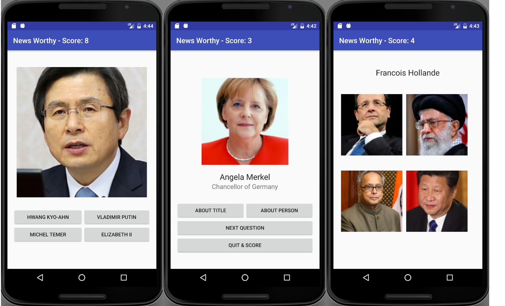

# NewsWorthy
Version 0.0.1: September 30, 2016
by [Karen Freeman-Smith](https://karenfreemansmith.github.io)

## Description
Capstone Project for Week 5, Android at Epicodus.
This is a flashcard/quiz type app to help the user learn who's who among US & World leaders.

## Technologies Used
Java, Android Studio

## Known Issues/To-Do
* Save to database/Read from database

* Logic for:
  * Level of play
  * High Scores(?)

* Post scores to social media

## Support & Contact
For questions, concerns, or suggestions please email karenfreemansmith@gmail.com

## Legal
*Licensed under the GNU General Public License v3.0*

Copyright (c) 2016 Copyright _[Karen Freeman-Smith](https://karenfreemansmith.github.io)_ All Rights Reserved.